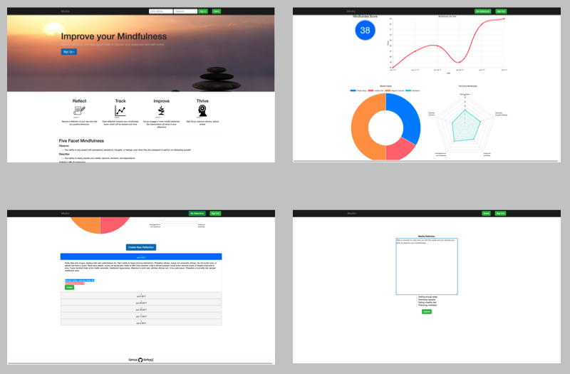
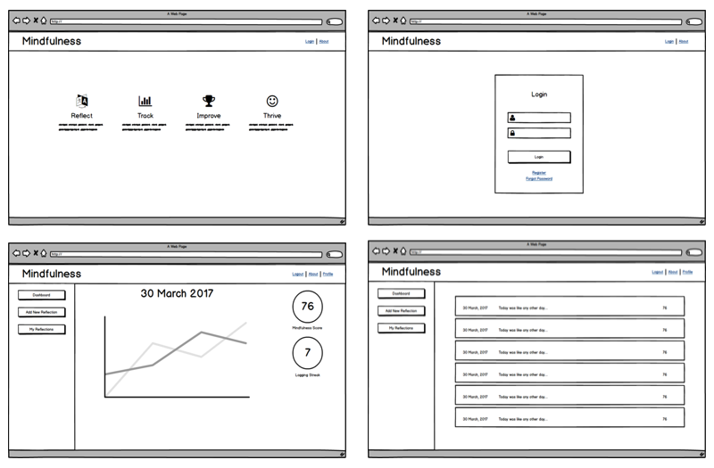

<h1>Mindfulness</h1>
<p><a href="https://still-thicket-16302.herokuapp.com/">Mindfulness</a> is a full-stafk web app that allows users to track their mindfulness and the habits which promote mindfulness.</p>


## Getting started
### Installing
```
>   git clone https://github.com/SirRobZ/mindfulness.git
>   cd mindfulness
>   npm install
```
### Launching
```
>   npm start
```
Then open [`localhost:8000`](http://localhost:8000) in a browser.
### Testing
```
>   npm test
```
<h2>Introduction</h2>
<p>The goal of the Mindfulness app is help user improve their mindfulness over time. Mindfulness being one's ability to be fully present and have control over how they percieve events, and how they choose to react to them.</p>

<h2>How it Works</h2>
<h3>Take the quiz, record a reflection</h3>
<p>When a user goes to create a new question they must first take the Five Facet Mindfulness Questionnaire. This 15 question multiple choice quiz will be scored to calculate the users mindfulness score as well as the score for each of the five facets of mindfulness. Next the user will fill out a reflection and also check off all of the activities they completed which helpto reinforce mindfulness.</p>
<h3>Track progress</h3>
<p>Users will have a dashboard which will show their mindfulness score over time, as well as a breakdown of their five-facet mindfulness and mindful activities. The dashboard will also provide users with a list of all of their previous reflections. Each reflection will show the mindfulness score and mindful activities for that reflection.</p>

<h2>Wireframes</h2>
<p>Initial wireframes were created for each page. Mockups of all key processes were designed with user flow in mind.</p>


<h2>Technology</h2>
<h3>Front End</h3>
<ul>
  <li>HTML5</li>
  <li>CSS3</li>
  <li>JavaScript</li>
  <li>jQuery</li>
  <li><a href="http://www.chartjs.org/">Chart.js</a>
</ul>
<h3>Back End</h3>
<ul>
  <li>Node.js + Express.js (web server)</li>
  <li>MongoDB (database)</li>
  <li><a href="https://mochajs.org/">Mocha</a> + <a href="https://www.npmjs.com/package/supertest>Supertest</a> (testing)</li>
  <li>Continuous integration and deployment with <a href="https://travis-ci.org/">Travis CI</a></li>
</ul>
<h3>Security</h3>
<ul>
  <li>User passwords are encrypted using <a href="https://github.com/dcodeIO/bcrypt.js">bcrypt.js</a>.</li>
  <li><a href="https://www.npmjs.com/package/jsonwebtoken">JSON Web Token</a> is used to control endpoints from unauthorized users.</li>
</ul>

<h2>Code Attributions</h2>
<h4>HTM/CSS Framework</h4>
<ul>
  <li>Bootstrap Example <a href:"https://v4-alpha.getbootstrap.com/examples/"></a></li>
</ul>


